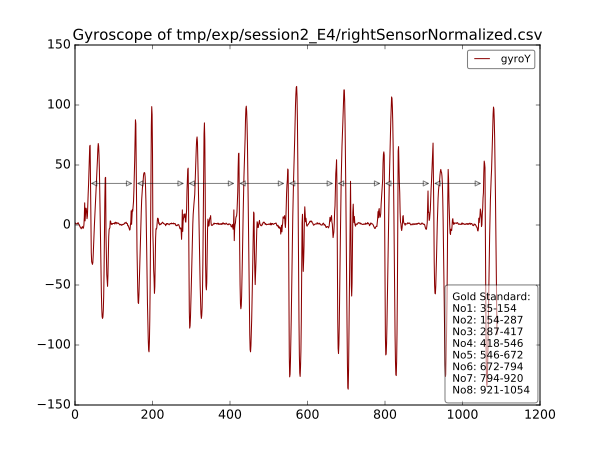

# sedater - A Sensor-Validation Converter
[](https://travis-ci.org/nce/sedater)
[](http://sedater.readthedocs.org/en/latest/?badge=latest)

Sedater is a **Se**nsor-Vali**dat**ion Convert**er** for motion based sensor 
systems like the Shimmer R2 or Vicon sensors. It converts the ValidationData to 
a more machine processable format and groups individual session data together.

# Basic Functionality
The tool includes two (somewhat) independent utilities:
- The parser, processor and exporter of Sensor-Validation files, called ``sedater``
- The plotter for SVG-graphics, called ``plotter``

## sedater - The Tool
Sedater imports files or directories which were exported by a Vicon or Shimmer (Foot) Sensorutility.
These files are usually hardly processable which this tool tries to solve.


### Data Import
The files or directories provided by commandline are crawled and all available
files are indexed for later analysis.

The indexing process includes a dissection of the filename. From which serveral
properties are extracted, like `session`, `exercise` and `sensor orientation`.
Based on these values, corresponding files are paired together (all files
belonging to the same session; left and right foot sensors, etc).

The following data conversion is done by two modules, because the sensors usually
export two kinds of files:
- [RawValidation Data](#TextValidation Processing)
- [TextValidation Data](#RawValidation Processing)

### TextValidation Processing
TextValidation data is stored in a readable (*kind of*) CSV file, looking like:
```
Meta1,Foo,,,,
Meta2,Bar,,,,
Meta3,Baz,,,,
Start,End
1,2
3,4
5,6
```
These files are imported, analyzed and later exported as well formed XML-files.

### RawValidation Processing
RawValidation data is straight from the sensors available as binary files.
These files will be detected based on the `.dat` filename extension.
Matching binary files are parsed as a stream of six `2B`-sized tuples
according to the following pattern:
```
    Binary File Format
                 1 11
    12 34 56 78 90 12 Bytes
    ,----------------------
    |  |  |  |  |  |  | ...
    `----------------------
     ^  ^  ^  ^  ^  ^
     |  |  |  |  |  `- Gyro Z
     |  |  |  |  `---- Gyro Y
     |  |  |  `------- Gyro X
     |  |  `---------- Accel Z
     |  `------------- Accel Y
     `---------------- Accel X
     With each single datum as uint16 (unsigned short)
        which composes one dataset to an 12B Array
```
After the import and unpacking of the binaries, the data needs to be normalized.

Each Sensor provides a unique CSV calibration file (provided on commandline),
with which the data is normalized by offset calculation.

The now normalized data is later exported as CSV files.
### Data Export
Both - the Raw and Text - data is exported back to the filesystem.

## Plotter - the graphing utility
All by sedater exported CSV files are plottable via the `matplotlib`.

The plotting process has to be manually invoked by the command line
([see Usage](#Usage)).
If an `annotation.xml` file is provided, the plotter is able to draw the
Gold Standard parameters contained in the file.

# Install
Cloning the repository should be enough
## Requirements
The tool has the following python [requirements](requirements.txt) 
which are easily resolved by executing:
```
pip install -r requirements.txt
```
The heaviest dependencies are `matplotlib` and `numpy` which are 
exclusivly used for the optional [plotting](#Plotting) of the 
Rawvalidation files. The main functionality is given without them.

If you choose to not rely on plotting simply don't install them by 
commenting them out in the [dependency file](requirements.txt) 
(prefix with: `#`).

## Python Version
The testcases are automatically running against multiple python versions:
- Python3.5.0
- Python3.4.2
- Python3.3.5

Rendering a green [build status](https://travis-ci.org/nce/sedater) 
is therefore a good indicator that the listed python versions are
likely to be working.

`Python2.7.10 & Python3.2` are currently not supported. 
This might change in the future.

# Usage
If you have access to ``/bin/bash`` (as you do on Linux systems), invoke the
binarys from the ``bin`` directory:
```
./bin/sedater -h
./bin/plotter -h
```
Consult the help message for command line parameters.

If you are on a Windows system (or don't have access to ``/bin/bash``), run the
``main.py`` respectively:
```
./sedater/main.py --help
./sedater/plotter/main.py --help
```

## Usage Examples
```
./bin/sedater -r tmp/A6DV.csv -l tmp/A917.csv -c -o tmp/exp/ tmp/ValidationRawData\
    tmp/GoldStandard_GaitRite tmp/GoldStandard_StrideBorders
```
resulting in:
```
tmp/exp
└── session2_E4
    ├── annotation.xml
    ├── leftSensorNormalized.csv
    ├── metainformation.xml
    └── rightSensorNormalized.csv
```
and after plotting:
```
./bin/plotter -c -g gyroY -x tmp/exp/session2_E4/annotation.xml\
    tmp/exp/session2_E4/leftSensorNormalized.csv\
    tmp/exp/session2_E4/rightSensorNormalized.csv
```
the following image is created:



Further examples are [here](USAGE_SAMPLES.md).

# Developer Documentation
The code is annotated by [docstrings](https://en.wikipedia.org/wiki/Docstring),
which are automatically parsed by [Sphinx](http://sphinx-doc.org/) and
online available at [readthedocs.org](readthedocs.org):

**Refer to the
[Developer documentation](http://sedater.readthedocs.org/en/latest/)
for further details**

# Testing
Run `nosetests` in the code directory (`sedater`). 

All tests are automatically executed by [Travis CI](travis-ci.org)
on each code update.

## Limitations
Unfortunately lacks the ``plotter`` testcases at the moment.
