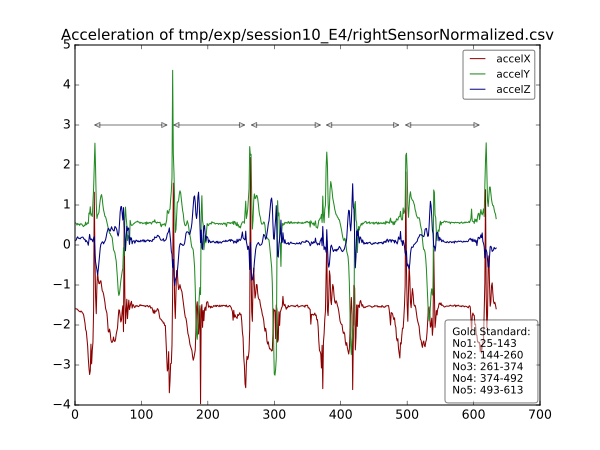
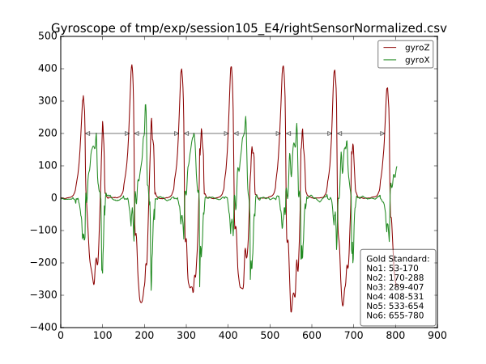

# More Usage examples
## Usage with missing files
```
» bin/sedater -l tmp/calibrationFiles/9A20.csv -o tmp/export -r tmp/calibrationFiles/9A1F.csv tmp/Controls_RawDataValidation/ tmp/Controls_GoldStandard_StrideBorders/
Found file without a matching partner 'tmp/Controls_RawDataValidation/GA112030E5_right.dat', pairing with itself to continue.
Found file without a matching partner 'tmp/Controls_RawDataValidation/GA112030E5_right.dat', pairing with itself to continue.

» tree tmp/export/
tmp/export/
└── session112030_E3
    ├── annotation.xml
    ├── leftSensorNormalized.csv
    ├── metainformation.xml
    └── rightSensorNormalized.csv

1 directory, 4 files
```
> The resulting files are way to big for proper graphing

## Multiple Sessions
```
» bin/sedater -r tmp/A6DF.csv -l tmp/A917.csv -c -o tmp/exp tmp/ValidationRawData/ tmp/GoldStandard_StrideBorders/

» tree tmp/exp
tmp/exp
├── session100_E4
│   ├── annotation.xml
│   ├── leftSensorNormalized.csv
│   ├── metainformation.xml
│   └── rightSensorNormalized.csv
├── session101_E4
│   ├── annotation.xml
│   ├── leftSensorNormalized.csv
│   ├── metainformation.xml
│   └── rightSensorNormalized.csv
├── session102_E4
│   ├── annotation.xml
│   ├── leftSensorNormalized.csv
│   ├── metainformation.xml
│   └── rightSensorNormalized.csv
```

## Plotting
```
» bin/plotter -x tmp/exp/session10_E4/annotation.xml\
    tmp/exp/session10_E4/rightSensorNormalized.csv
```


```
» bin/plotter -g gyroZ -g gyroX -x tmp/exp/session105_E4/annotation.xml\
    tmp/exp/session105_E4/rightSensorNormalized.csv
```

